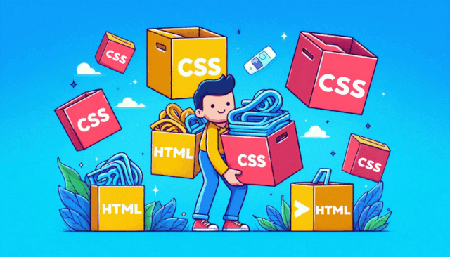

# css-strain

**css-strain** is a powerful tool for CSS selector obfuscation with optional HTML file adjustments. It's ideal for avoiding class and ID conflicts in large-scale projects, where code maintenance and consistency are essential.

## Features

- **CSS Selector Obfuscation:** Generates unique and random selectors for classes and IDs, preventing conflicts and overlaps.
- **Optional HTML Manipulation:** Automatically replaces old selectors with new ones in HTML files, ensuring visual styles remain intact. This feature can be used independently or in combination with CSS obfuscation.
- **Flexible Configuration:** Allows customization of prefixes, versions, and the length of random strings to best fit your project.
- **Simple Integration:** Easy to use with minimal integration, making it perfect for new or existing projects.

### Use css-strain to keep your CSS organized, secure, and conflict-free, with the flexibility to adjust your HTML as needed.